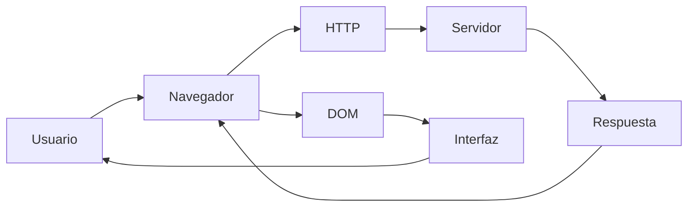
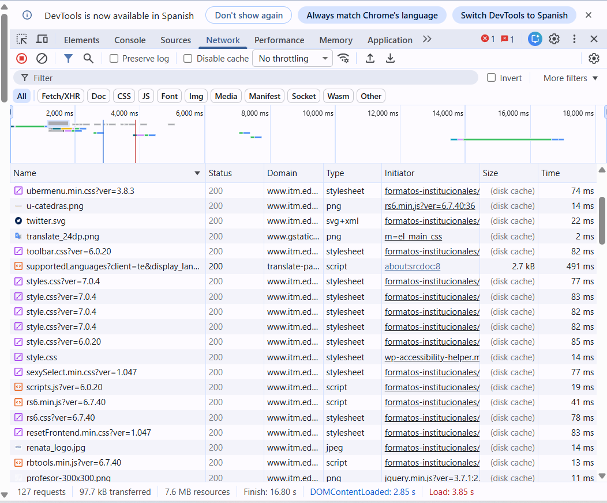
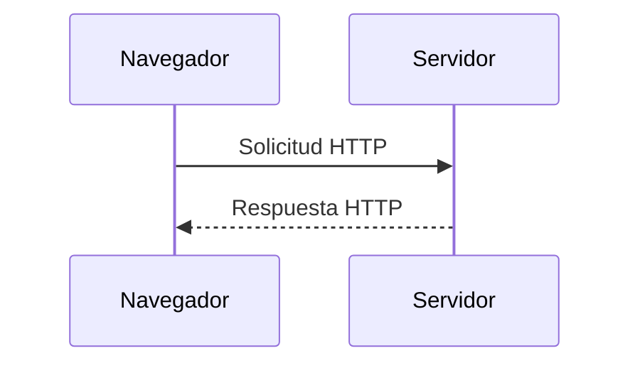
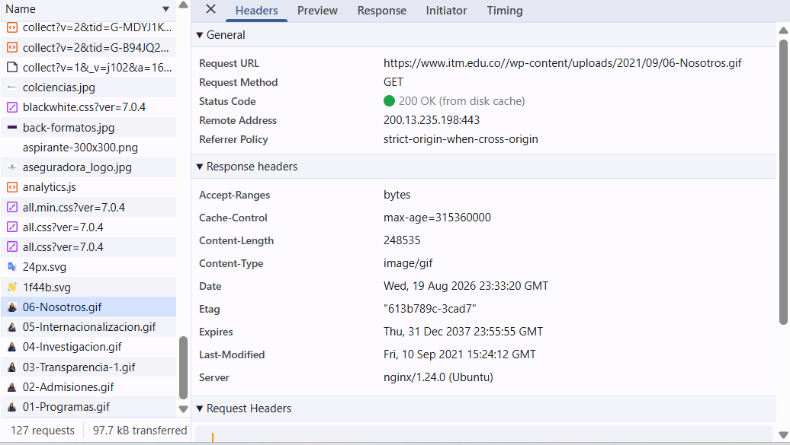
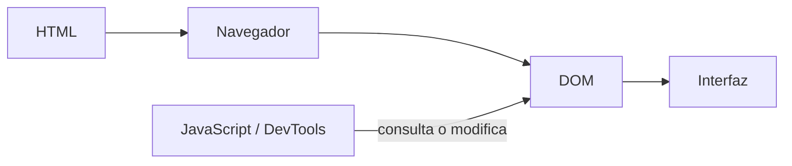
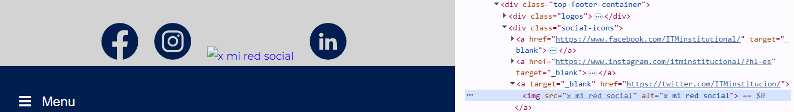
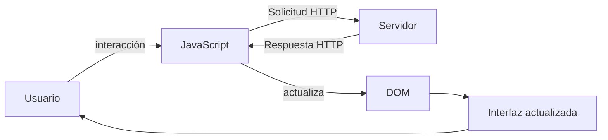
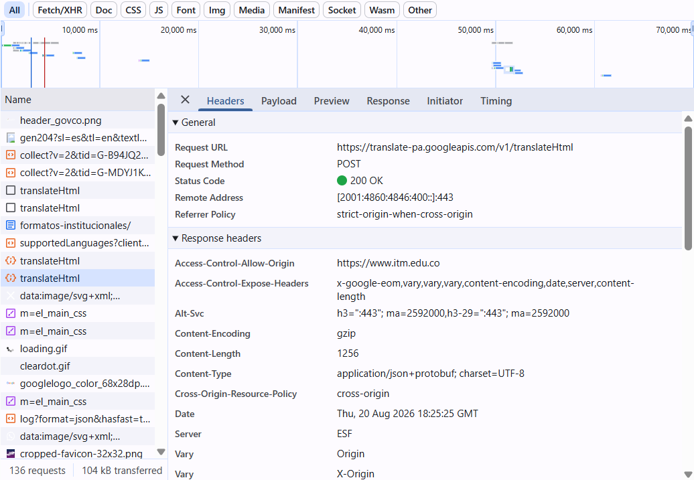
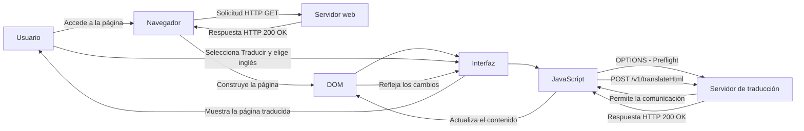

# Laboratorio 01 --- Análisis del funcionamiento de una aplicación web

> **Curso:** Aplicaciones y Servicios Web\
> **Modalidad:** Práctica de laboratorio\
> **Entrega:** Repositorio GitHub --- archivo `README.md`\
> **Evidencias:** Carpeta `evidencias/`

------------------------------------------------------------------------

## Objetivo de la práctica

Analizar el funcionamiento de una aplicación web real mediante las
herramientas de desarrollo del navegador, identificando los recursos
cargados, las solicitudes y respuestas HTTP, la estructura DOM y las
interacciones entre cliente y servidor.

## Resultado esperado

Al finalizar la práctica, el estudiante deberá poder reconstruir y
documentar el flujo observado entre:



> El diagrama anterior representa los **componentes que serán
> analizados**. El diagrama final de la práctica deberá ser construido
> por el estudiante a partir de sus propias observaciones.

------------------------------------------------------------------------

# 1. Preparación del entorno

1.  Ingrese a la aplicación web indicada por el docente.
2.  Abra las **herramientas de desarrollo** del navegador.
3.  Identifique las herramientas **Red / Network** y **Elementos /
    Elements**.
4.  Cree la siguiente estructura dentro del repositorio:

``` text
laboratorio-01/
├── README.md
└── evidencias/
```

El archivo `README.md` será el informe de la práctica. La carpeta
`evidencias/` contendrá las capturas utilizadas para sustentar los
resultados.

------------------------------------------------------------------------

# 2. Identificación de recursos de la aplicación

Abra la herramienta **Red / Network** y recargue completamente la
aplicación.

Observe las solicitudes generadas durante la carga e identifique como
mínimo **cinco recursos**, procurando seleccionar tipos diferentes:
documento HTML, CSS, JavaScript, imágenes, fuentes u otros.

## Resultados

Complete la tabla:

  Recurso                   Tipo         Dominio                                            Tamaño
  ---------                 ------       ---------                                          --------
  Marca-pais.png            png          www.itm.edu.co                                     disk cache     
  
  SupportedLanguajes        Script       https://translate.google.com/translate_a
                                         /element.js?b=GoogleLanguageTranslatorInit         2.7 kB
                                         

  min_educacion_logo.jpg   jpeg         www.itm.edu.co                                      disk cache

  linkedin.svg             svg+xml      www.itm.edu.co                                      disk cache

  style.css                stylesheet   www.itm.edu.co                                      disk cache
                             
                             

**Total de solicitudes observadas:** `127`

## Evidencia

Guarde una captura de la pestaña Network como:

``` text
evidencias/network.png
```

Inclúyala aquí:

``` markdown

```

### Análisis

**¿Por qué una sola URL puede generar múltiples solicitudes HTTP?**

> Ya que la URL inicial nos carga el documento principal o página web, y este puede requerir muchos recursos adicionales, cada uno mediante su propia solicitud HTTP.

------------------------------------------------------------------------

# 3. Análisis de una solicitud HTTP

En **Network**, seleccione una de las solicitudes realizadas por el
navegador, preferiblemente la correspondiente al documento principal.

Identifique la información solicitada a continuación.

  Elemento              Resultado
  --------------------- -----------
  URL                   
  Método HTTP           
  Código de estado      
  Host / dominio        
  Tipo de recurso       
  Tiempo de respuesta   

## Flujo que se está observando



## Evidencia

Guarde una captura de los detalles de la solicitud como:

``` text
evidencias/request.png
```

Inclúyala en el informe:

``` markdown

```

### Análisis

**¿Qué recurso solicitó el navegador?**

> El navegador solicitó el recurso 06-Nosotros.gif mediante una solicitud HTTP con el método GET.

**¿Qué información permite determinar si la solicitud fue atendida
correctamente?**

> El código de estado HTTP 200 OK permite determinar que la solicitud fue atendida correctamente, ya que indica que el servidor procesó la solicitud con éxito.

------------------------------------------------------------------------

# 4. Inspección del DOM

Seleccione un elemento visible de la aplicación, por ejemplo:

-   un botón;
-   un título;
-   un enlace;
-   un campo de formulario;
-   un elemento del menú.

Utilizando **Elementos / Elements**:

1.  Localice el elemento dentro del DOM.
2.  Identifique la etiqueta HTML utilizada.
3.  Modifique temporalmente su contenido desde las herramientas de
    desarrollo.
4.  Observe el cambio producido en la interfaz.
5.  Registre la evidencia.

## Resultados

**Elemento seleccionado:** `Ícono de Twitter/X de la red social`

**Etiqueta HTML:** ``

**Contenido original:** `<a target="_blank" href="https://twitter.com/ITMinstitucion/"></a>`

**Modificación realizada:** `<a target="_blank" href="https://twitter.com/ITMinstitucion/"></a>`

El proceso observado puede representarse conceptualmente así:



## Evidencia

Guarde la captura como:

``` text
evidencias/dom.png
```

Inclúyala aquí:

``` markdown

```

### Análisis

**¿La modificación realizada sobre el DOM alteró permanentemente la
aplicación o los archivos almacenados en el servidor? Justifique.**

> No. La modificación realizada sobre el DOM no alteró permanentemente la aplicación ni los archivos almacenados en el servidor. Esto se debe a que el cambio se realizó localmente mediante las herramientas de desarrollo del navegador, modificando únicamente la representación de la página cargada en el navegador. Al recargar la página, el navegador vuelve a solicitar o cargar los archivos originales y la modificación desaparece

------------------------------------------------------------------------

# 5. Análisis de una interacción dinámica

Regrese a **Network** y limpie las solicitudes registradas.

Realice una acción dentro de la aplicación que pueda generar una
interacción con el servidor, por ejemplo:

-   consultar;
-   buscar;
-   filtrar;
-   seleccionar una opción;
-   enviar información.

Observe si aparece una nueva solicitud en Network.

## Resultados

  Elemento                       Resultado
  ------------------------------ -----------
  Acción realizada               Se seleccionó la opción para traducir la página al inglés.  
  ¿Generó una nueva solicitud?   Si
  URL solicitada                 https://translate-pa.googleapis.com/v1/translateHtml    
  Método HTTP                    POST 
  Código de estado               200 OK
  Tipo de respuesta              application/json+protobuf; charset=UTF-8

## Ciclo de interacción

Utilice este esquema únicamente como referencia conceptual para
interpretar lo observado:



## Evidencia

Guarde la captura como:

``` text
evidencias/interaccion.png
```

Inclúyala aquí:

``` markdown

```

### Análisis

**Explique la relación entre la acción realizada por el usuario y la
solicitud observada.**

> Al presionar la opción de traducir y seleccionar el idioma inglés, el navegador generó una interacción con el servicio de traducción. Primero se realizó una solicitud previa (OPTIONS) para verificar los permisos necesarios para realizar la comunicación y, posteriormente, se envió una solicitud POST al servicio translateHtml de Google, encargado de procesar y devolver el contenido traducido de la página.

------------------------------------------------------------------------

# 6. Reconstrucción del flujo observado

A partir de **sus propias evidencias**, construya un diagrama Mermaid
que represente el funcionamiento de la aplicación analizada.

El diagrama deberá incluir, cuando corresponda:

`Usuario` · `Navegador` · `JavaScript` · `Solicitud HTTP` · `Servidor` ·
`Respuesta HTTP` · `DOM` · `Interfaz`

> **No copie los diagramas anteriores.** Esta sección debe representar
> el flujo que usted pudo comprobar durante la práctica.

Reemplace el siguiente bloque con su diagrama:



------------------------------------------------------------------------

# 7. Observado vs. inferido

Una herramienta de desarrollo permite observar una parte del sistema,
pero no necesariamente todo lo que ocurre en el servidor.

Clasifique sus hallazgos:

## Elementos observados directamente

- Servicios
- Lenguaje de programación de los servicios   
- Flujo de servicios  

## Elementos inferidos

- Código fuente completo de la página y la aplicación
- Lenguaje de programación utilizado en el servidor  
- Procesamiento interno de los servicios

> No presente como observado un proceso interno que las herramientas del
> navegador no permitan comprobar directamente.

------------------------------------------------------------------------

# 8. Conclusiones

Redacte **tres conclusiones técnicas** derivadas de la práctica.

1. Se evidenció que una página web puede realizar múltiples solicitudes HTTP para cargar los diferentes recursos necesarios para su funcionamiento, como documentos, imágenes, archivos CSS, JavaScript y otros servicio. 

2. Se concluyó que las herramientas de desarrollo permiten observar la comunicación entre el navegador y los servidores, así como inspeccionar y modificar temporalmente el DOM, pero no permiten conocer directamente el código fuente completo ni el procesamiento interno de los servicios. 

3. Las aplicaciones web pueden generar solicitudes HTTP de forma dinámica como respuesta a las interacciones del usuario, permitiendo comunicarse con servicios externos y actualizar el contenido de la interfaz sin necesidad de recargar completamente la página.

Las conclusiones deben explicar lo aprendido a partir de la evidencia y
no limitarse a describir las actividades realizadas.

------------------------------------------------------------------------

# 9. Entrega

La estructura final esperada es:

``` text
laboratorio-01/
├── README.md
└── evidencias/
    ├── network.png
    ├── request.png
    ├── dom.png
    └── interaccion.png
```

Antes de entregar, verifique:

-   [ ] El `README.md` se visualiza correctamente en GitHub.
-   [ ] Las imágenes se muestran dentro del README.
-   [ ] Se documentaron al menos cinco recursos.
-   [ ] Se analizó una solicitud HTTP.
-   [ ] Se identificó y modificó un elemento del DOM.
-   [ ] Se analizó una interacción de la aplicación.
-   [ ] El diagrama final corresponde a lo observado.
-   [ ] Se diferenciaron elementos observados e inferidos.
-   [ ] Se redactaron tres conclusiones técnicas.
-   [ ] Se realizó `commit` y `push` al repositorio.

------------------------------------------------------------------------

## Criterio de documentación

> **Las capturas son evidencia, no la respuesta.**

Cada evidencia debe estar acompañada por una explicación que indique
**qué se observó, qué significa y cómo se relaciona con el
funcionamiento de la aplicación web**.
